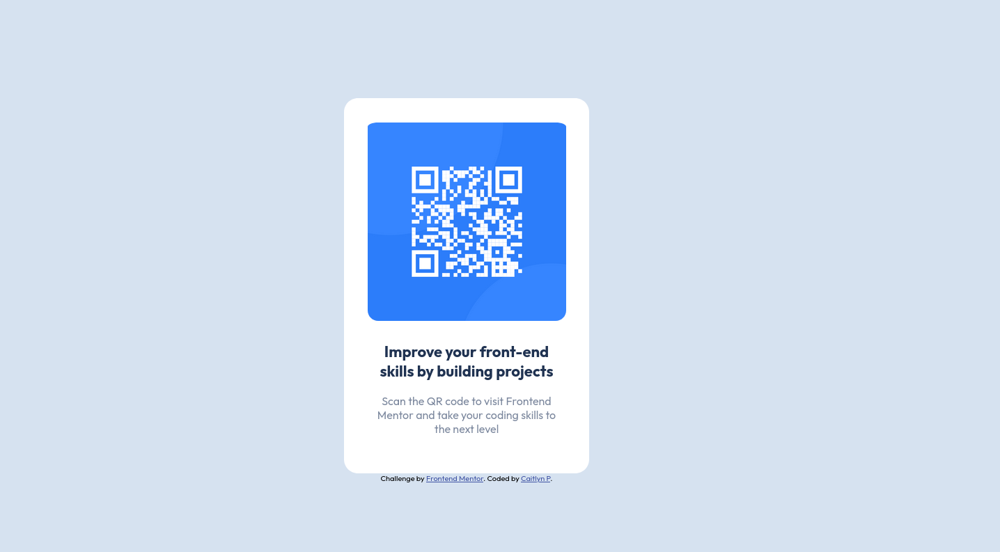

# qr-code-component-FrontendMentorChallenge
# Frontend Mentor - QR code component solution

This is a solution to the [QR code component challenge on Frontend Mentor](https://www.frontendmentor.io/challenges/qr-code-component-iux_sIO_H). Frontend Mentor challenges help you improve your coding skills by building realistic projects. 

## Table of contents

- [Overview](#overview)
  - [Screenshot](#screenshot)
- [My process](#my-process)
  - [Built with](#built-with)
  - [What I learned](#what-i-learned)
  - [Continued development](#continued-development)
  - [Useful resources](#useful-resources)
- [Author](#author)


### Screenshot




## My process

### Built with

- CSS custom properties
- CSS Grid
- Mobile-first workflow

### What I learned
I was able to get a better understanding of using CSS to modify elements in the document. Below is a piece of code that I am happy with:

```css

    img{
      border-radius: 15px;
      max-width: 95%;
      height: auto;
      margin-left: auto;
      margin-right: auto;
      display: block;
      padding-top: 3%;
    }
```

### Continued development

I want to focus on staying organized, and drawing out a plan to help me visualize what needs to be done.

### Useful resources

- [CSS Styling Images](https://www.w3schools.com/css/css3_images.asp) - This helped me to remember how to modify images. 

## Author

- Frontend Mentor - [@Cpuening84169482](https://www.frontendmentor.io/profile/Cpuening84169482) 

